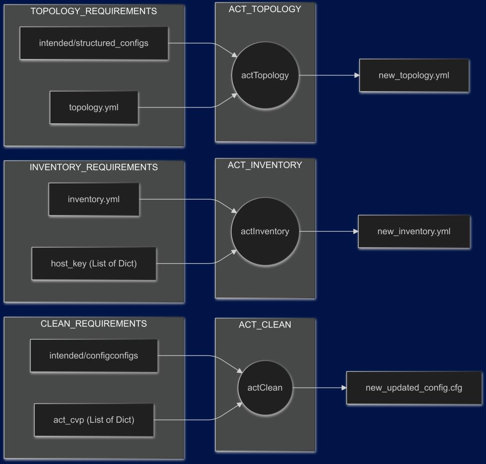

# ACT Automation

At the moment this document was written ACT did not have an API.
The following are some commands to reduce the manual work of creating ACT lab.
The idea is to reduce the friction to deploy AVD valid configuration into ACT with the minimum amount of effort to quickly iterate.

## Overview

The process is divided in 3 main steps:
- Topology
- Inventory
- Clean

### Topology
The `actTopology` command is used to generate an ACT topology file based on the intended configurations generated by AVD. 

`crispy-enigma actTopology -i topology.yml -O act-topology.yml -f intended/structured_configs`

Takes as input an initial ACT topology file and a folder containing structured configuration files. The initial ACT topology file can be created with the `-e` flag. Additional information can be added like tests hosts, servers and etc, that are not part of the network devices.

### Inventory

The `actInventory` updates the AVD inventory with the data needed for ACT. This are some of the changes performed:

- Remove the serial number.
- Update the CVP host, username and password for ACT.

The initial inventory file it is not modified a new one is created to be used with ACT only.

### Clean

The `actClean` command is used to update the configuration created by AVD and adapt it to CVP in ACT.
The following changes are performed:

- updates the MTU of all the interfaces to 1500.
- updates the daemon terminAttr to use a configuration supported by ACT.
- updates username and password to avoid using real username and password on ACT.
- remove span monitor ports configuration as it is not supported by ACT.
- removes AAA configuration to use local authentication.
- removes SNMP configurations.
- removes queue-monitor streaming and length.
