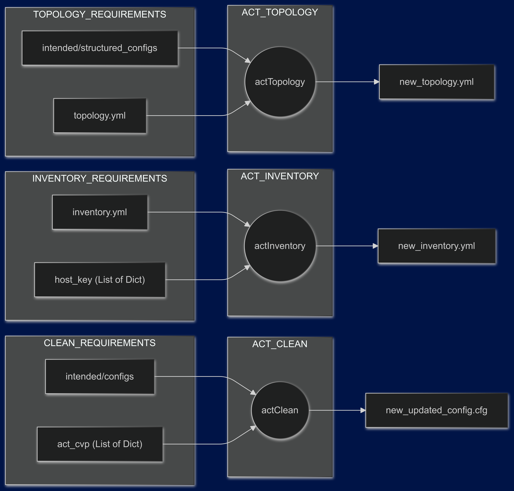

# ACT Automation

At the moment this document was written ACT did not have an API.
The following are some commands to reduce the manual work of creating ACT lab.

## Overview

The `actTopology` command is used to generate an ACT topology file based on the intended configurations generated by AVD.
`crispy-enigma actTopology -i topology.yml -O act-topology.yml -f intended/structured_configs`
Takes as input an initial ACT topology file and a folder containing structured configuration files. The initial ACT topology file can be created with the `-e` flag. Additional information can be added like tests hosts, servers and etc, that are not part of the network devices.

The `actInventoy` updates the AVD inventory with the data needed for ACT. This are some of the changes performed:

* Remove the serial number.
* Update the CVP host, username and password.

The initial inventory file it is not modified a new one is created to be used with ACT only.